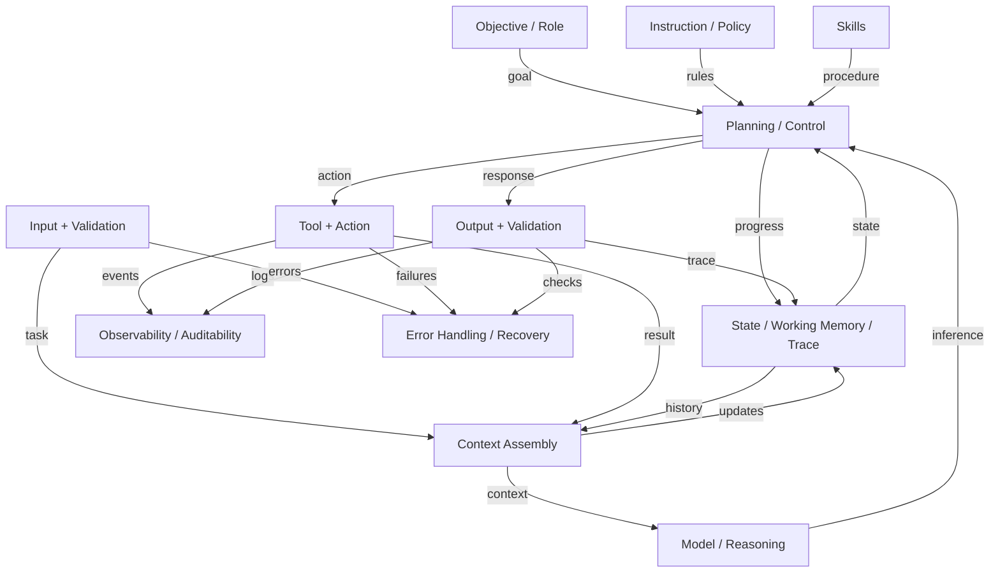

# Agent Anatomy

## Table of Contents

- [Agent Anatomy](#agent-anatomy)
  - [Table of Contents](#table-of-contents)
  - [Overview](#overview)
    - [Mandatory elements](#mandatory-elements)
      - [1. Objective or role definition](#1-objective-or-role-definition)
      - [2. Instruction and policy layer](#2-instruction-and-policy-layer)
      - [3. Input interface and input validation [[agent-input-design]]](#3-input-interface-and-input-validation)
      - [4. Model or reasoning engine [[agent-model-or-reasoning-engine-design]]](#4-model-or-reasoning-engine)
      - [5. Context assembly layer](#5-context-assembly-layer)
      - [6. Planning and control loop](#6-planning-and-control-loop)
      - [7. Tool and action layer](#7-tool-and-action-layer)
      - [8. Skills layer](#8-skills-layer)
      - [9. Guardrails and safety controls](#9-guardrails-and-safety-controls)
      - [10. Output interface and output validation](#10-output-interface-and-output-validation)
      - [11. State, working memory, and execution trace](#11-state-working-memory-and-execution-trace)
      - [12. Observability and auditability](#12-observability-and-auditability)
      - [13. Error handling and recovery](#13-error-handling-and-recovery)
    - [Optional or class-dependent elements](#optional-or-class-dependent-elements)
      - [14. Long-term memory](#14-long-term-memory)
      - [15. Retrieval subsystem or knowledge layer](#15-retrieval-subsystem-or-knowledge-layer)
      - [16. MCP integration layer](#16-mcp-integration-layer)
      - [17. Identity, authentication, and authorization](#17-identity-authentication-and-authorization)
      - [17.5 Action authorization policy layer](#175-action-authorization-policy-layer)
      - [18. Human approval and escalation layer](#18-human-approval-and-escalation-layer)
      - [19. Workflow orchestration and scheduling](#19-workflow-orchestration-and-scheduling)
      - [20. Multi-agent coordination layer](#20-multi-agent-coordination-layer)
      - [21. Self-evaluation and reflection](#21-self-evaluation-and-reflection)
      - [22. Learning and adaptation layer](#22-learning-and-adaptation-layer)
      - [23. Cost, quota, and performance management](#23-cost-quota-and-performance-management)
      - [24. Provenance and citation layer](#24-provenance-and-citation-layer)
      - [25. Communication and approval channel layer](#25-communication-and-approval-channel-layer)

## Overview

An agent can be understood as a set of layers and subsystems. Some are mandatory for nearly every agent, while others
are optional or become mandatory only for certain classes.

### Mandatory elements

| # | Mandatory element |
|---|---|
| 1 | [Objective or role definition](#1-objective-or-role-definition) |
| 2 | [Instruction and policy layer](#2-instruction-and-policy-layer) |
| 3 | [Input interface and input validation [[agent-input-design]]](#3-input-interface-and-input-validation) |
| 4 | [Model or reasoning engine [[agent-model-or-reasoning-engine-design]]](#4-model-or-reasoning-engine) |
| 5 | [Context assembly layer](#5-context-assembly-layer) |
| 6 | [Planning and control loop](#6-planning-and-control-loop) |
| 7 | [Tool and action layer](#7-tool-and-action-layer) |
| 8 | [Skills layer](#8-skills-layer) |
| 9 | [Guardrails and safety controls](#9-guardrails-and-safety-controls) |
| 10 | [Output interface and output validation](#10-output-interface-and-output-validation) |
| 11 | [State, working memory, and execution trace](#11-state-working-memory-and-execution-trace) |
| 12 | [Observability and auditability](#12-observability-and-auditability) |
| 13 | [Error handling and recovery](#13-error-handling-and-recovery) |

#### 1. Objective or role definition

The agent must have a defined purpose.

Typical contents:

- mission or role
- scope boundaries
- success criteria
- non-goals
- priority rules

Most relevant to:

- all agents

This requirements concern applies to the agent as a whole to define its functional purpose.

#### 2. Instruction and policy layer

The agent needs instructions that shape behavior.

Typical contents:

- system and developer instructions
- domain policies
- user-defined action policies
- safety rules
- style or output conventions
- escalation rules

Most relevant to:

- all agents
- especially institutional, regulated, and specialist agents

This requirements concern applies to the agent as a whole to define its functional constraints and compliance goals for its users.

#### 3. Input interface and input validation [[agent-input-design]]

The agent needs a way to receive tasks, state, and context, and to validate them before use.

Mandatory responsibilities:

- parse user or machine inputs
- validate schema, type, and required fields
- reject malformed, ambiguous, or unsafe requests when appropriate
- normalize inputs into internal task objects
- classify sensitivity and risk where relevant

Examples of validation:

- required parameter checks
- identity and authorization checks
- path or URL validation
- prompt injection detection heuristics
- file format and size validation
- policy eligibility checks for actions
- classification of requested actions into allow, deny, or review-required outcomes

Most relevant to:

- all agents
- especially interactive, event-driven, and institutional agents

#### 4. Model or reasoning engine [[agent-model-or-reasoning-engine-design]]

The agent needs one or more engines for interpretation, generation, classification, planning, or decision support.

This may include:

- foundation models
- deterministic rules
- classifiers
- planners
- retrieval-augmented generation pipelines

Most relevant to:

- all agents

#### 5. Context assembly layer

The agent must gather the information needed for the current step.

Typical sources:

- current user input
- conversation history
- working memory
- retrieved documents
- tool results
- environment state
- policies and skills

Most relevant to:

- all agents
- especially conversational and deliberative agents

#### 6. Planning and control loop

The agent needs a control structure for deciding what to do next.

Typical functions:

- interpret goal
- decide whether to answer, ask, retrieve, plan, or act
- decompose tasks
- choose tools or skills
- monitor progress
- replan on failure or new information

Possible patterns:

- simple react loop
- plan-act-observe loop
- workflow or state machine
- hierarchical planner
- orchestrator-worker pattern

Most relevant to:

- all but especially autonomous, multi-step, and multi-agent systems

#### 7. Tool and action layer

Modern agents usually need explicit capabilities beyond text generation.

This layer includes:

- tool definitions
- action schemas
- permission boundaries
- action categories and risk labels
- execution adapters
- side-effect awareness

Examples:

- shell command execution
  - locally executable command line tools (e.g., jq, ripgrep, curl)
- browser control
- repository access
- ticketing systems
- APIs and databases
- message queues
- LLM-improvised code (Python) execution

Most relevant to:

- interactive and autonomous agents
- embodied or environment-acting agents

#### 8. Skills layer

Skills package reusable task knowledge, procedures, and guardrails for recurring workflows.

A skill may include:

- domain-specific instructions
- required inputs and prerequisites
- ordered procedures
- tool selection guidance
- validation checks
- reporting format
- limitations and guardrails

Why this matters:

- reduces repeated prompt engineering
- improves consistency across runs
- supports specialization and reuse
- provides a governance point for approved workflows

Most relevant to:

- specialist agents
- institutional agents
- multi-agent systems with role specialization

#### 9. Guardrails and safety controls

The agent needs constraints that prevent or limit unsafe behavior.

Guardrails may include:

- capability allowlists and denylists
- user-defined allow, deny, and review-required policies for action classes
- approval requirements for destructive actions
- protected resource boundaries
- data loss prevention rules
- secrets redaction
- prompt injection resistance patterns
- sandboxing
- rate limits and budget limits
- kill switches

Most relevant to:

- all agents
- especially autonomous, institutional, regulated, and environment-acting agents

#### 10. Output interface and output validation

The agent should validate outputs before returning or executing them.

Mandatory responsibilities:

- confirm outputs match expected schema or format
- verify references, commands, file paths, or action parameters
- check policy compliance
- assess confidence or uncertainty where appropriate
- prevent malformed or dangerous tool invocations

Examples:

- JSON schema validation
- command sanitization
- citation presence checks
- safe markdown or HTML rendering checks
- post-condition checks before applying a change

Most relevant to:

- all agents
- especially interactive, autonomous, and regulated agents

#### 11. State, working memory, and execution trace

The agent needs short-horizon state to track what is happening during a task.

Includes:

- conversation or task state
- todo or progress tracking
- intermediate artifacts
- action history
- temporary variables

Most relevant to:

- all agents
- especially conversational, interactive, and multi-step agents

#### 12. Observability and auditability

The agent should record enough information to understand behavior and outcomes.

Typical telemetry:

- prompts or prompt hashes
- tool invocations
- approvals and denials
- retrieved documents
- validation failures
- outcomes and error types
- latency, token, and cost metrics

Most relevant to:

- institutional, autonomous, enterprise, and regulated agents

#### 13. Error handling and recovery

The agent needs explicit behavior for failures.

Typical patterns:

- retry with bounds
- fallback model or tool
- ask clarifying questions
- partial completion reporting
- checkpoint and resume
- human escalation

Most relevant to:

- all agents
- especially autonomous, event-driven, and high-throughput agents

### Optional or class-dependent elements

| # | Optional or class-dependent element |
|---|---|
| 14 | [Long-term memory](#14-long-term-memory) |
| 15 | [Retrieval subsystem or knowledge layer](#15-retrieval-subsystem-or-knowledge-layer) |
| 16 | [MCP integration layer](#16-mcp-integration-layer) |
| 17 | [Identity, authentication, and authorization](#17-identity-authentication-and-authorization) |
| 17.5 | [Action authorization policy layer](#175-action-authorization-policy-layer) |
| 18 | [Human approval and escalation layer](#18-human-approval-and-escalation-layer) |
| 19 | [Workflow orchestration and scheduling](#19-workflow-orchestration-and-scheduling) |
| 20 | [Multi-agent coordination layer](#20-multi-agent-coordination-layer) |
| 21 | [Self-evaluation and reflection](#21-self-evaluation-and-reflection) |
| 22 | [Learning and adaptation layer](#22-learning-and-adaptation-layer) |
| 23 | [Cost, quota, and performance management](#23-cost-quota-and-performance-management) |
| 24 | [Provenance and citation layer](#24-provenance-and-citation-layer) |
| 25 | [Communication and approval channel layer](#25-communication-and-approval-channel-layer) |

#### 14. Long-term memory

Long-term memory stores durable information across sessions.

Possible contents:

- user preferences
- historical decisions
- repository or system facts
- prior task summaries
- learned patterns
- semantic memory and episodic memory
- optional self-improvement loop artifacts such as retrospectives, durable lessons learned,
  and approved memory updates derived from prior task outcomes

Benefits:

- personalization
- continuity across sessions
- reduced repeated context loading
- improved long-running task performance

Risks:

- stale or incorrect memory
- privacy leakage
- policy drift if memory overrides instructions

Best practices:

- explicit retention policy
- provenance and timestamps
- confidence and freshness tracking
- memory editing and deletion controls
- separation between user memory, team memory, and institutional memory
- if using memory to support a self-improvement loop, require bounded and reviewable updates so
  learning does not silently override policy or accumulate unsafe drift

Most relevant to:

- personal agents
- institutional knowledge agents
- autonomous long-running agents
- multi-session assistants

#### 15. Retrieval subsystem or knowledge layer

Separate from long-term memory, this layer retrieves authoritative external knowledge.

Examples:

- documentation search
- vector search
- code search
- enterprise knowledge bases
- policy repositories

Most relevant to:

- knowledge-intensive conversational agents
- institutional agents
- research and support agents

#### 16. MCP integration layer

MCP provides a standardized way for agents to access tools, prompts, and resources from external servers.

Architectural responsibilities:

- discovery of MCP servers and capabilities
- authentication and connection management
- structured invocation of tools/resources
- trust and approval handling for remote capabilities
- error propagation and retries
- auditability of external interactions

Why this matters:

- decouples agent logic from integration details
- enables tool portability across runtimes
- supports mixed local and remote topology
- creates a standard boundary for governed external access

Most relevant to:

- interactive agents
- institutional agents
- multi-tool and multi-system agents
- federated agents

#### 17. Identity, authentication, and authorization

Some minimal identity handling is often implicit, but strong IAM becomes a distinct architectural element in
enterprise systems.

Includes:

- user identity
- service identity
- delegated authority
- role and policy evaluation
- tenant or namespace isolation

Most relevant to:

- institutional, federated, and regulated agents

#### 17.5 Action authorization policy layer

This layer decides whether a specific requested action is allowed, denied, or requires human review and approval
before execution. It applies not only to destructive operations, but to any governed action such as reading files,
editing files, running commands, fetching web content, applying skills, or invoking tools and MCP resources.

Responsibilities:

- evaluate user-defined policies, organizational policies, and environment policies together
- classify actions by type, target, sensitivity, and risk
- return a clear decision of allow, deny, or review-required
- attach rationale, policy source, and any required approval route
- support fine-grained policies by tool, skill, file path, repository, host, data class, or operation type
- ensure policy decisions are enforced before execution rather than merely logged after the fact

Examples:

- allow reading documentation but require approval before editing protected files
- deny web fetches to untrusted domains
- allow approved skills but require review before using a new MCP server
- allow test execution but deny package installation without explicit approval

Most relevant to:

- interactive agents
- autonomous agents
- institutional agents
- regulated agents
- personal agents with strong customization preferences

#### 18. Human approval and escalation layer

This layer inserts a person into the loop for selected decisions.

Typical uses:

- high-risk changes
- irreversible actions
- sensitive data access
- low-confidence conclusions
- policy exceptions

Required design concerns:

- identify who is allowed to review or approve each action class
- route review requests through the user's preferred communication channels
- distinguish between informative notifications, requested reviews, and binding approvals
- record decision status, timestamps, rationale, and approver identity
- support reminders, timeout policies, delegation, and escalation when no response arrives
- preserve enough task context in the approval request for a human to make a sound decision

Typical channels:

- chat and collaboration tools
- email
- service desk or change-management tickets
- IDE or command-line notifications
- mobile push notifications
- workflow inboxes and approval dashboards

Most relevant to:

- interactive, autonomous, institutional, and regulated agents
- especially collaborative agents designed around staged review and approval

#### 19. Workflow orchestration and scheduling

Needed when agents execute background jobs, recurring tasks, or parallel work.

Includes:

- timers and schedules
- queues
- workflow DAGs
- distributed executors
- checkpoint persistence

Most relevant to:

- autonomous, event-driven, enterprise-scale, and high-throughput agents

#### 20. Multi-agent coordination layer

Needed only when multiple agents collaborate.

Includes:

- role assignment
- message passing
- shared blackboard or workspace
- supervisor control
- termination conditions

Most relevant to:

- multi-agent systems
- enterprise and specialist ecosystems

#### 21. Self-evaluation and reflection

An agent may review its own work before finalizing it.

Examples:

- critique pass
- plan verification
- hallucination checks
- compare-against-spec review
- answer consistency checks

Most relevant to:

- deliberative agents
- quality-sensitive coding or analysis agents
- regulated or high-trust settings

#### 22. Learning and adaptation layer

Some agents adapt over time using feedback, memory updates, prompt refinement, or policy tuning.

Important constraint:

- online adaptation should be bounded and governable
- do not allow uncontrolled drift in safety-critical environments

Most relevant to:

- long-lived personal agents
- optimization-heavy enterprise systems
- research agents

#### 23. Cost, quota, and performance management

Needed when scale, latency, or budget matters.

Includes:

- model routing by cost and quality
- token budgets
- request quotas
- caching
- concurrency limits
- service-level objectives

Most relevant to:

- enterprise-scale, high-throughput, and real-time agents

#### 24. Provenance and citation layer

Tracks where facts, instructions, memory items, and actions came from.

Benefits:

- explainability
- debugging
- trust
- compliance reviews

Most relevant to:

- research agents
- institutional agents
- regulated systems

#### 25. Communication and approval channel layer

This layer manages how the agent communicates with humans outside the core inference loop. It is distinct from a basic
chat interface because it must support durable, policy-aware coordination for reviews and approvals.

Responsibilities:

- maintain per-user or per-role channel preferences
- map task types, policy decisions, and risk levels to permitted channels
- format channel-specific review requests and summaries
- support asynchronous responses and correlation back to the originating task
- handle accessibility, localization, urgency, and quiet-hours policies

Why it matters:

- the same approval request may need different delivery paths for different users
- adoption suffers when agents force all review interactions into a single interface
- regulated workflows often require approved channels of record

Most relevant to:

- collaborative human-in-the-loop agents
- institutional agents
- autonomous agents that require checkpoints
- multi-agent systems that hand work off to humans
