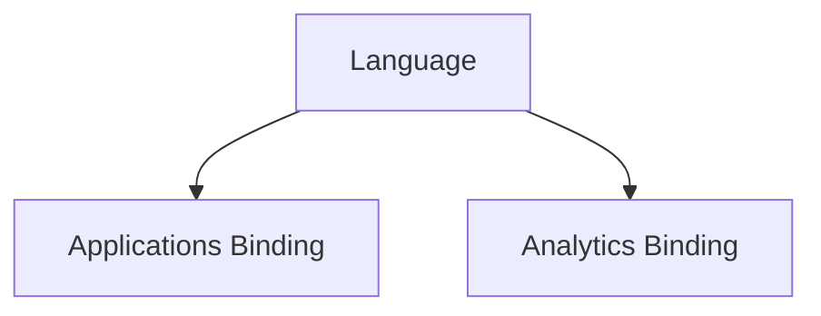

Ontology can apply to agents at two layers:
1. Language
2. Binding language to an implementation

## Language

Classes, properties, and relationships form the vocabulary of the language that will be recognized by tools offered to AI agents.

Tools represent verbs that act against instances of these classes, the instance properties of these classes, and the instance relationships of these classes.

## Applications Binding

An MCP server offers a set of related tools for agents to use. A tool is identified by a name, and it has a concise description. Typically (we shall mandate), the name is a combination of a verb and a class. For example, `read_order` . Variations on this pattern are acceptable. The class may be pluralized when acting on a collection of instances. The name may be further qualified by the name of a property or a relationship, if acting on one of those. The name and description properties of a tool provide all the information necessary for an agent to translate an intent (input) into a tool invocation as a step in its plan for execution.

An MCP server binds the tools to the application's programming interfaces (APIs), the command line interfaces (CLIs), or the database schema (if circumventing the application's interfaces is allowed). This translates the tool invocation input according to the ontology into application-specific terminology, and from application-specific terminology back to the ontology for output.

## Analytics Binding

In AI/ML analytics, the ontology functions as a semantic translation layer between the Agent and the underlying data platform (e.g., Data Lakehouse, Snowflake/BigQuery). By mapping ontological classes to schema objects, the agent can autonomously perform exploratory data analysis (EDA) without needing explicit knowledge of database-level join logic.

1. **Semantic Mapping**: The ontology bridges business metrics (e.g., "Customer Churn") to platform-level tables and column transforms (e.g., `FACT_SUBSCRIPTIONS`, `status='CANCELLED'`).
2. **Feature Store Integration**: When an agent interacts with a Feature Store, the ontology defines the relationship between raw events and derived features, allowing the agent to request temporal feature aggregates via semantic high-level commands.
3. **Automated Data Discovery**: The ontology allows the agent to navigate the schema catalog using business-domain concepts rather than technical table metadata, enabling automated drill-down paths for diagnostic analytics.
4. **Consistency**: By enforcing the ontology at the binding layer, metrics output by the agent remain consistent across sessions, ensuring that "Customer Churn" is calculated identically regardless of the specific agent session or prompt structure.
