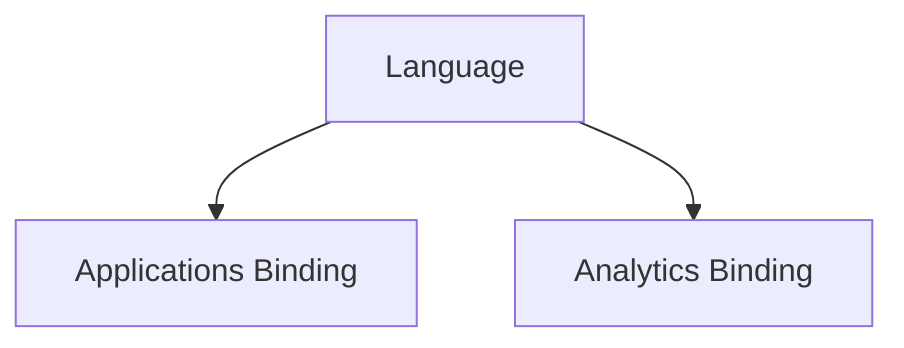

Ontology can apply to agents at two layers:
1. Language
2. Binding language to an implementation

## Language

Classes, properties, and relationships form the vocabulary of the language that will be recognized by tools offered to AI agents.

Tools represent verbs that act against instances of these classes, the instance properties of these classes, and the instance relationships of these classes.

## Applications Binding

An MCP server offers a set of related tools for agents to use. A tool is identified by a name, and it has a concise description. Typically (we shall mandate), the name is a combination of a verb and a class. For example, `read_order` . Variations on this pattern are acceptable. The class may be pluralized when acting on a collection of instances. The name may be further qualified by the name of a property or a relationship, if acting on one of those. The name and description properties of a tool provide all the information necessary for an agent to translate an intent (input) into a tool invocation as a step in its plan for execution.

An MCP server binds the tools to the application's programming interfaces (APIs), the command line interfaces (CLIs), or the database schema (if circumventing the application's interfaces is allowed). This translates the tool invocation input according to the ontology into application-specific terminology, and from application-specific terminology back to the ontology for output.

## Analytics Binding

In AI/ML analytics, the ontology functions as a semantic translation layer between the Agent and the underlying data platform (e.g., Data Lakehouse, Snowflake/BigQuery). By mapping ontological classes to schema objects, the agent can autonomously perform exploratory data analysis (EDA) without needing explicit knowledge of database-level join logic.

1. **Semantic Mapping**: The ontology bridges business metrics (e.g., "Customer Churn") to platform-level tables and column transforms (e.g., `FACT_SUBSCRIPTIONS`, `status='CANCELLED'`).
2. **Feature Store Integration**: When an agent interacts with a Feature Store, the ontology defines the relationship between raw events and derived features, allowing the agent to request temporal feature aggregates via semantic high-level commands.
3. **Automated Data Discovery**: The ontology allows the agent to navigate the schema catalog using business-domain concepts rather than technical table metadata, enabling automated drill-down paths for diagnostic analytics.
4. **Consistency**: By enforcing the ontology at the binding layer, metrics output by the agent remain consistent across sessions, ensuring that "Customer Churn" is calculated identically regardless of the specific agent session or prompt structure.

# How does ontology apply for each element of the system architecture?

| Architectural element                                | Ontology format                      | Purpose                                                                                                                                                                                           | Ontology materialization                                                                                                                                                                                |
| ---------------------------------------------------- | ------------------------------------ | ------------------------------------------------------------------------------------------------------------------------------------------------------------------------------------------------- | ------------------------------------------------------------------------------------------------------------------------------------------------------------------------------------------------------- |
| Requirements Specification                           | YAML domain model                    | Ensure that requirements are specified in a language and according to a domain model that is consistent with the ontology.                                                                        | Requirements represented by Jira requirements, initiatives, epics, stories.  Ontology specifications that are used by skills to validate that requirements specifications adhere to the ontology. |
| Design of input validation for conversational agents | JSON Schema                          | Ensure that input validation is designed to use language and a domain model that is consistent with the ontology.                                                                                 | Ontology specifications that are used by skills to validate that design specifications and code implementations adhere to the ontology.                                                                 |
| Design of prompts for LLM reasoning                  | Ontology-embedded templates          | Ensure prompts use ontological vocabulary to guide LLM reasoning towards structured, domain-consistent outputs aligned with agent anatomy elements like model/reasoning engine and planning loop. | Prompt libraries referencing ontology classes/properties; output validators checking against ontology, drawing from context assembly and output validation layers.                                      |
| Design of MCP tools                                  | Verb-Class naming + descriptions     | Define tools using ontology-derived names (verb + class/property) and descriptions for agent intent-to-tool mapping, per tool/action layer in agent anatomy.                                      | MCP tool schemas bound to ontology classes/relationships; validation skills ensuring compliance with MCP integration layer.                                                                             |
| Runtime input validation                             | JSON Schema                          | Validate runtime inputs against ontology-derived schemas to ensure domain consistency, as in input interface/validation layer.                                                                    | Runtime validators derived from ontology; error messages referencing violations, integrated with error handling.                                                                                        |
| Runtime prompts for LLM                              | Dynamic ontology injection           | Inject ontology into LLM context dynamically for consistent reasoning, via context assembly layer.                                                                                                | Context assembly embedding ontology excerpts relevant to task, informed by instruction/policy and state/working memory.                                                                                 |
| Runtime tool use by agent harness                    | Ontology-matched tool selection      | Harness selects tools by matching ontology elements to tool verbs/classes, in planning/control loop.                                                                                              | Planning logic using ontology for tool choice; execution trace logging mappings, per tool/action layer.                                                                                                 |
| Runtime tool execution against API or CLI            | Binding mappings                     | Translate ontology-based tool calls to specific API/CLI invocations, via applications binding.                                                                                                    | Binding adapters in tool execution layer mapping ontology terms to app params, with guardrails.                                                                                                         |
| Knowledge base                                       | RDF (Resource Description Framework) | This turns retrieval from: `similar text search` into `semantic knowledge retrieval`.                                                                                                             | RDF triple store queried via SPARQL over ontological classes/relationships; integrated with retrieval subsystem/knowledge layer.                                                                        |
| Data lake / data warehouse for analytics             | SQL schema mapping                   | Bridge business concepts to data schema via ontology for semantic EDA, as in analytics binding.                                                                                                   | database queries  database schema mapped via ontology bindings.                                                                                                                                   |
| Data set preparation for model training              | Feature schemas                      | Align data prep pipelines with ontology for consistent features, supporting model training consistency.                                                                                           | Data pipelines validating against ontology-derived schemas; feature store integration with ontological properties.                                                                                      |
## Ontology Formats

| Format          | Main Purpose             | Strength                |
| --------------- | ------------------------ | ----------------------- |
| RDF             | Generic graph data model | Interoperability        |
| RDFS            | Basic schemas            | Simplicity              |
| OWL             | Logical reasoning        | Rich semantics          |
| SKOS            | Taxonomies/vocabularies  | Controlled vocabularies |
| SHACL           | Validation               | Data quality            |
| SPARQL          | Querying                 | Graph search            |
| JSON-LD         | Web-friendly RDF         | API/web integration     |
| Turtle          | Human-readable RDF       | Authoring               |
| RDF/XML         | XML RDF exchange         | Legacy enterprise       |
| OBO             | Biomedical ontologies    | Domain specialization   |
| Topic Maps      | Knowledge navigation     | Topic-centric modeling  |
| Common Logic    | Formal logic reasoning   | Expressiveness          |
| Property Graphs | Operational graphs       | Performance             |
| Schema.org      | Structured web metadata  | SEO/search              |
