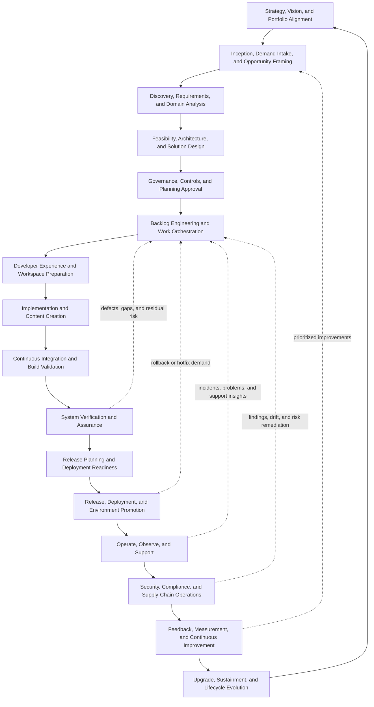
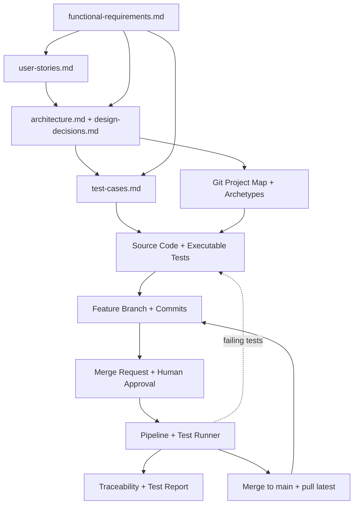

# Dark Software Factory

## Table of Contents

- [Dark Software Factory](#dark-software-factory)
  - [Table of Contents](#table-of-contents)
  - [Software Development Life Cycle](#software-development-life-cycle)
  - [Implications for a Dark Software Factory](#implications-for-a-dark-software-factory)
  - [Specification Documents Needed to Facilitate the SDLC](#specification-documents-needed-to-facilitate-the-sdlc)
  - [Coverage Expectations for a Spec-Driven Factory](#coverage-expectations-for-a-spec-driven-factory)
  - [Additional Artifacts Needed Beyond Markdown Specifications](#additional-artifacts-needed-beyond-markdown-specifications)
  - [Additional SDLC and Specification Gaps to Cover](#additional-sdlc-and-specification-gaps-to-cover)
  - [Completion Criteria for End-to-End AI Automation Readiness](#completion-criteria-for-end-to-end-ai-automation-readiness)
  - [Proof of Concept](#proof-of-concept)
    - [Objective](#objective)
    - [Minimal Scope](#minimal-scope)
    - [Minimal Required Specification Stages](#minimal-required-specification-stages)
    - [Minimal Agent Roles](#minimal-agent-roles)
    - [Minimal Information Flow](#minimal-information-flow)
    - [Minimal Workflow](#minimal-workflow)
    - [Minimal Success Criteria](#minimal-success-criteria)
    - [Recommended Constraints for the First Prototype](#recommended-constraints-for-the-first-prototype)
    - [Example Minimal Artifact Set](#example-minimal-artifact-set)
    - [Why This is the Right Minimal Slice](#why-this-is-the-right-minimal-slice)

## Software Development Life Cycle



1. **Strategy, vision, and portfolio alignment**
   1. Define business outcomes, customer value, and operational goals.
   2. Identify target users, stakeholders, sponsors, operators, and governance authorities.
   3. Establish strategic themes, product roadmaps, investment horizons, and success criteria.
   4. Evaluate market drivers, regulatory obligations, technology trends, and competitive pressures.
   5. Prioritize initiatives within a portfolio.
      1. Assess urgency, value, cost, risk, dependencies, and capacity.
      2. Approve, defer, merge, or retire ideas.
      3. Assign ownership, funding, and expected measurable outcomes.

2. **Inception, demand intake, and opportunity framing**
   1. Capture ideas, problems, incidents, requests, and improvement opportunities.
   2. Classify the demand.
      1. New product or platform capability.
      2. Enhancement to an existing capability.
      3. Defect correction, security remediation, or operational hardening.
      4. Upgrade, migration, deprecation, or end-of-life response.
   3. Create the initial concept package.
      1. Problem statement.
      2. Desired outcomes.
      3. Scope boundaries and assumptions.
      4. Stakeholder map.
      5. Preliminary risks and constraints.
   4. Decide whether to reject, incubate, or advance the initiative for detailed discovery.

3. **Discovery, requirements, and domain analysis**
   1. Elicit business, user, operational, security, compliance, and support requirements.
   2. Analyze the current state.
      1. Existing systems, interfaces, repositories, services, and data flows.
      2. Known incidents, technical debt, and pain points.
      3. Organizational procedures, approvals, and handoffs.
   3. Define the future state.
      1. Functional requirements.
      2. Non-functional requirements.
         1. Availability, scalability, performance, resilience.
         2. Security, privacy, auditability, and compliance.
         3. Operability, supportability, observability, and maintainability.
      3. Data requirements, event flows, integration contracts, and lifecycle states.
   4. Produce artifacts.
      1. Requirements documents.
      2. Use cases, user journeys, and service blueprints.
      3. Backlog epics, features, stories, and acceptance criteria.
      4. Definitions of done, readiness criteria, and quality gates.

4. **Feasibility, architecture, and solution design**
   1. Evaluate solution options.
      1. Build versus buy versus reuse.
      2. Manual, automated, agent-assisted, or autonomous workflow choices.
      3. Centralized versus distributed implementation tradeoffs.
   2. Define target architecture.
      1. Business architecture and operating model impacts.
      2. Application, data, integration, infrastructure, and security architecture.
      3. Agent architecture, skill composition, tool usage, and human-in-the-loop control points.
   3. Design for the full lifecycle.
      1. Delivery pipeline design.
      2. Environment topology and promotion flow.
      3. Observability, support, upgrade, rollback, and decommissioning paths.
   4. Produce and review architecture artifacts.
      1. Context, container, component, and workflow diagrams.
      2. ADRs, threat models, risk assessments, and operational procedures.
      3. Interface specifications, API contracts, schemas, and event definitions.

5. **Governance, controls, and planning approval**
   1. Identify all required governance checkpoints.
      1. Architecture review.
      2. Security and privacy review.
      3. Compliance and legal review.
      4. Financial, sourcing, and supply-chain review.
      5. Operational readiness and support review.
   2. Plan execution.
      1. Sequence milestones, increments, releases, and dependencies.
      2. Assign teams, roles, skills, tools, environments, and budgets.
      3. Define reporting, traceability, audit evidence, and decision logs.
   3. Approve the initiative to enter implementation.

6. **Backlog engineering and work orchestration**
   1. Decompose scope into deliverable work units.
      1. Epics.
      2. Features.
      3. Stories.
      4. Tasks.
      5. Spikes and research items.
   2. Define implementation sequencing and dependency management.
   3. Prepare execution metadata.
      1. Acceptance criteria.
      2. Test cases and validation scenarios.
      3. Security checks and policy rules.
      4. Documentation updates.
      5. Required evidence for sign-off.
   4. Route work to the right delivery mechanism.
      1. Human-led execution.
      2. AI-assisted execution.
      3. Fully automated pipeline or workflow execution.

7. **Developer experience and workspace preparation**
   1. Provision repositories, access, credentials, secrets, and environment permissions.
   2. Initialize local and remote workspaces.
      1. Clone or synchronize repositories.
      2. Configure toolchains, runtimes, and dependency sources.
      3. Configure agent workspaces, MCP servers, skills, and policy files.
   3. Establish branch, issue, and traceability conventions.
   4. Verify that the developer and agent environment is reproducible and compliant.

8. **Implementation and content creation**
   1. Produce or modify software and related assets.
      1. Source code.
      2. Infrastructure as code.
      3. Configuration.
      4. Policies and rules.
      5. Documentation and runbooks.
      6. Tests, fixtures, and synthetic data.
   2. Apply engineering practices.
      1. Small, traceable changes.
      2. Secure coding and supply-chain hygiene.
      3. Pairing, peer review, and agent-assisted generation with guardrails.
      4. Continuous synchronization between code, docs, and operational procedures.
   3. Keep provenance.
      1. Link changes to requirements, decisions, risks, and approvals.
      2. Capture AI prompts, tool actions, generated artifacts, and review outcomes where required.

9. **Continuous integration and build validation**
   1. Trigger validation on every meaningful change.
   2. Execute automated checks.
      1. Formatting, linting, and static analysis.
      2. Unit, component, contract, and integration tests.
      3. Secret scanning, SAST, dependency checks, license checks, and policy checks.
      4. Artifact creation, signing, packaging, and provenance generation.
   3. Publish results.
      1. Pass/fail status.
      2. Test reports and coverage.
      3. Security findings and remediation recommendations.
      4. Build artifacts and evidence bundles.
   4. Enforce merge or promotion gates based on quality policies.

10. **System verification and assurance**
    1. Validate that the integrated system satisfies requirements.
    2. Perform specialized testing.
       1. End-to-end functional validation.
       2. Performance, scale, and resilience testing.
       3. Security, penetration, privacy, and abuse-case testing.
       4. Accessibility, usability, and documentation validation.
       5. Disaster recovery, failover, and rollback rehearsal.
    3. Compare outcomes to acceptance criteria, SLAs, SLOs, and compliance controls.
    4. Record defects, waivers, residual risks, and required corrective actions.

11. **Release planning and deployment readiness**
    1. Prepare release contents and versioning.
       1. Select included changes.
       2. Finalize release notes, upgrade notes, migration notes, and known issues.
       3. Verify compatibility matrices and dependency constraints.
    2. Confirm readiness.
       1. Operational runbooks are current.
       2. Support teams are informed.
       3. Monitoring, alerts, dashboards, and playbooks are enabled.
       4. Rollback and recovery paths are tested.
    3. Obtain required approvals for production deployment.

12. **Release, deployment, and environment promotion**
    1. Promote artifacts through environments according to policy.
    2. Execute deployment procedures.
       1. Automated GitOps, CI/CD, or workflow orchestration.
       2. Controlled manual steps where required.
       3. Change windows, freeze rules, and communication procedures.
    3. Validate the deployment.
       1. Smoke tests.
       2. Post-deploy checks.
       3. Security control verification.
       4. Business service confirmation.
    4. Either continue rollout, pause, remediate, or roll back.

13. **Operate, observe, and support**
    1. Run the system in production or managed environments.
    2. Continuously observe health and behavior.
       1. Logs, metrics, traces, events, and synthetic checks.
       2. Capacity, cost, security posture, and user experience indicators.
       3. Service-level objectives, error budgets, and trend analysis.
    3. Respond to operational needs.
       1. Incident management.
       2. Problem management.
       3. Service requests.
       4. Routine maintenance and patching.
       5. Knowledge management and support enablement.
    4. Capture operational evidence and lessons for future automation.

14. **Security, compliance, and supply-chain operations**
    1. Continuously monitor for vulnerabilities, policy drift, unsupported technologies, and exposure.
    2. Run recurring scans, audits, and attestations.
       1. Dependency and malware scanning.
       2. Container and image scanning.
       3. Infrastructure and configuration compliance scanning.
       4. SBOM generation and verification.
       5. Business approval and supportability validation for technologies in the stack.
    3. Triage and remediate findings.
       1. Prioritize based on severity, exploitability, impact, and exposure.
       2. Assign owners and due dates.
       3. Track exceptions, compensating controls, and closure evidence.
    4. Feed findings back into backlog, architecture, and release decisions.

15. **Feedback, measurement, and continuous improvement**
    1. Gather feedback from users, operators, auditors, support teams, and delivery teams.
    2. Measure outcomes.
       1. Product adoption and business value.
       2. Delivery speed and quality.
       3. Reliability, security, and operational efficiency.
       4. AI-agent effectiveness, coverage, accuracy, and intervention rates.
    3. Perform reviews.
       1. Retrospectives.
       2. Post-incident reviews.
       3. Release reviews.
       4. Governance and audit reviews.
    4. Improve processes, tools, skills, policies, architectures, and organizational practices.

16. **Upgrade, sustainment, and lifecycle evolution**
    1. Plan and execute upgrades.
       1. Platform upgrades.
       2. Dependency refreshes.
       3. Security patch rollups.
       4. Data migrations and compatibility transitions.
    2. Manage long-term sustainment.
       1. Technical debt reduction.
       2. Refactoring and re-architecture.
       3. Documentation refresh.
       4. Skill, tool, and agent evolution.
    3. Address end-of-life transitions.
       1. Deprecation notices.
       2. Replacement planning.
       3. Archival, shutdown, and data-retention procedures.
    4. Feed new needs back into strategy and inception, restarting the lifecycle.

## Implications for a Dark Software Factory

The SDLC above is intentionally written as an unbroken chain so the organization can map each activity
to one or more human roles, AI agents, reusable skills, workflow engines, and governed tools. A dark
software factory should minimize uninstrumented handoffs by making every stage observable, traceable,
policy-aware, and automatable where appropriate.

This means the factory model should support agentic assistance not only for coding, but also for demand
intake, requirements analysis, architecture reviews, governance evidence collection, test generation,
release coordination, operations, vulnerability remediation, and upgrade planning. Any gap in the
workflow should be treated as an opportunity to define additional agents, skills, or tools.

## Specification Documents Needed to Facilitate the SDLC

The SDLC requires a companion set of Markdown specifications so every lifecycle activity is grounded in
explicit, reviewable, version-controlled artifacts. The objective is to make each handoff machine-
readable enough for AI agents, skills, workflow engines, and policy tools to participate safely and
consistently.

1. **Strategy, vision, and portfolio alignment specifications**
   ```mermaid
   flowchart TD
       PS[portfolio-strategy.md] --> PV[product-vision.md]
       PS --> OMX[outcome-metrics.md]
       PV --> OMX

        click PS href "#specification-documents-needed-to-facilitate-the-sdlc" "portfolio-strategy.md"
        click PV href "#specification-documents-needed-to-facilitate-the-sdlc" "product-vision.md"
        click OMX href "#specification-documents-needed-to-facilitate-the-sdlc" "outcome-metrics.md"
   ```

   1. `docs/specs/portfolio-strategy.md`
      1. Strategic themes, business drivers, investment priorities, and target outcomes.
      2. Portfolio guardrails, prioritization model, and funding assumptions.
   2. `docs/specs/product-vision.md`
      1. Product mission, target users, value proposition, and success measures.
      2. Problem framing and desired future state.
   3. `docs/specs/outcome-metrics.md`
      1. Business KPIs, adoption metrics, operational targets, and review cadence.

2. **Inception and intake specifications**
   ```mermaid
   flowchart TD
       II[idea-intake.md] --> BC[business-case.md]
       II --> SS[scope-statement.md]
       BC --> SS

        click II href "#specification-documents-needed-to-facilitate-the-sdlc" "idea-intake.md"
        click BC href "#specification-documents-needed-to-facilitate-the-sdlc" "business-case.md"
        click SS href "#specification-documents-needed-to-facilitate-the-sdlc" "scope-statement.md"
   ```

   1. `docs/specs/idea-intake.md`
      1. Request source, demand type, rationale, urgency, sponsor, and stakeholders.
      2. Initial constraints, risks, and expected benefits.
   2. `docs/specs/business-case.md`
      1. Cost, value, dependencies, assumptions, and decision options.
   3. `docs/specs/scope-statement.md`
      1. In-scope items, out-of-scope items, exclusions, and boundary conditions.

3. **Requirements and analysis specifications**
   ```mermaid
   flowchart TD
       DM[domain-model.md] --> UC[use-cases.md]
       UC --> FR[functional-requirements.md]
       UC --> US[user-stories.md]
       FR --> US
       FR --> NFR[non-functional-requirements.md]
       NFR --> SLO[service-level-objectives.md]
       US --> PJ[personas-and-journeys.md]
       SLO --> PJ

        click DM href "#specification-documents-needed-to-facilitate-the-sdlc" "domain-model.md"
        click UC href "#specification-documents-needed-to-facilitate-the-sdlc" "use-cases.md"
        click FR href "#specification-documents-needed-to-facilitate-the-sdlc" "functional-requirements.md"
        click US href "#specification-documents-needed-to-facilitate-the-sdlc" "user-stories.md"
        click NFR href "#specification-documents-needed-to-facilitate-the-sdlc" "non-functional-requirements.md"
        click SLO href "#specification-documents-needed-to-facilitate-the-sdlc" "service-level-objectives.md"
        click PJ href "#specification-documents-needed-to-facilitate-the-sdlc" "personas-and-journeys.md"
   ```

   1. `docs/specs/domain-model.md`
      1. Core business entities, relationships, states, events, and terminology.
   2. `docs/specs/use-cases.md`
      1. Primary and alternate flows, actor goals, preconditions, and postconditions.
   3. `docs/specs/user-stories.md`
      1. Complete set of user stories covering all functional requirements.
      2. Traceability from epics to features to stories to acceptance criteria.
      3. Positive paths, negative paths, exception paths, edge cases, and role-based variations.
      4. Story fields should include:
         1. Story identifier.
         2. Persona or actor.
         3. Trigger.
         4. Goal.
         5. Business value.
         6. Preconditions.
         7. Acceptance criteria.
         8. Dependencies.
         9. Linked risks, controls, and test cases.
   4. `docs/specs/functional-requirements.md`
      1. Canonical functional requirements catalog.
      2. Unique identifiers for each requirement.
      3. Mapping to stories, APIs, UI flows, data rules, and tests.
   5. `docs/specs/non-functional-requirements.md`
      1. Full quality attribute catalog across reliability, scalability, security, privacy,
         maintainability, supportability, operability, usability, accessibility, portability, and cost.
      2. Required constraints, measurable thresholds, and ownership.
   6. `docs/specs/service-level-objectives.md`
      1. Service level objectives for all non-functional requirements that must be objectively measured.
      2. Latency, throughput, availability, durability, recovery, deployment frequency, defect escape,
         security response, and other quality-of-service targets.
      3. Indicators, objectives, alert thresholds, error budgets, and reporting cadence.
   7. `docs/specs/personas-and-journeys.md`
      1. User personas, operator personas, admin personas, and end-to-end journeys.

4. **Architecture and design specifications**
   ```mermaid
   flowchart TD
       ARCH[architecture.md] --> DD[design-decisions.md]
       ARCH --> API[api-contracts.md]
       ARCH --> DATA[data-model.md]
       ARCH --> EVT[event-model.md]
       ARCH --> SEC[security-model.md]
       SEC --> TM[threat-model.md]

        click ARCH href "#specification-documents-needed-to-facilitate-the-sdlc" "architecture.md"
        click DD href "#specification-documents-needed-to-facilitate-the-sdlc" "design-decisions.md"
        click API href "#specification-documents-needed-to-facilitate-the-sdlc" "api-contracts.md"
        click DATA href "#specification-documents-needed-to-facilitate-the-sdlc" "data-model.md"
        click EVT href "#specification-documents-needed-to-facilitate-the-sdlc" "event-model.md"
        click SEC href "#specification-documents-needed-to-facilitate-the-sdlc" "security-model.md"
        click TM href "#specification-documents-needed-to-facilitate-the-sdlc" "threat-model.md"
   ```

   1. `docs/specs/architecture.md`
      1. Context, containers, components, trust boundaries, and integration patterns.
   2. Per component:
      1. `docs/specs/design-decisions.md`
         1. Architecture decision records and rationale.
      2. `docs/specs/api-contracts.md`
         1. Endpoints, payloads, schemas, status codes, validation rules, and compatibility guarantees.
      3. `docs/specs/data-model.md`
         1. Logical and physical models, retention policies, and migration rules.
      4. `docs/specs/event-model.md`
         1. Event types, producers, consumers, ordering rules, and replay/idempotency expectations.
   3. `docs/specs/security-model.md`
      1. Identity, access control, secrets handling, encryption, audit logging, and trust assumptions.
   4. `docs/specs/threat-model.md`
      1. Assets, attack surfaces, abuse cases, risks, mitigations, and residual risk acceptance.

5. **Governance and planning specifications**
   ```mermaid
   flowchart TD
       GOV[governance-checkpoints.md] --> DP[delivery-plan.md]
       GOV --> RR[risk-register.md]
       GOV --> CC[compliance-controls.md]
       RR --> DP
       CC --> DP

        click GOV href "#specification-documents-needed-to-facilitate-the-sdlc" "governance-checkpoints.md"
        click DP href "#specification-documents-needed-to-facilitate-the-sdlc" "delivery-plan.md"
        click RR href "#specification-documents-needed-to-facilitate-the-sdlc" "risk-register.md"
        click CC href "#specification-documents-needed-to-facilitate-the-sdlc" "compliance-controls.md"
   ```

   1. `docs/specs/governance-checkpoints.md`
      1. Required reviews, approvers, entry criteria, exit criteria, and evidence requirements.
   2. `docs/specs/delivery-plan.md`
      1. Milestones, release increments, dependencies, staffing, and critical path.
   3. `docs/specs/risk-register.md`
      1. Risks, likelihood, impact, mitigation, contingency, and owners.
   4. `docs/specs/compliance-controls.md`
      1. Control objectives, mapped requirements, evidence, and validation procedures.

6. **Implementation specifications**
   Per component
   ```mermaid
   flowchart TD
       RS[repository-structure.md] --> CS[coding-standards.md]
       RS --> CFG[configuration-spec.md]
       CFG --> FF[feature-flags.md]
       CS --> FF

        click RS href "#specification-documents-needed-to-facilitate-the-sdlc" "repository-structure.md"
        click CS href "#specification-documents-needed-to-facilitate-the-sdlc" "coding-standards.md"
        click CFG href "#specification-documents-needed-to-facilitate-the-sdlc" "configuration-spec.md"
        click FF href "#specification-documents-needed-to-facilitate-the-sdlc" "feature-flags.md"
   ```

   1. `docs/specs/repository-structure.md`
      1. Repository layout, ownership boundaries, and naming conventions.
   2. `docs/specs/coding-standards.md`
      1. Style rules, secure coding practices, review expectations, and prohibited patterns.
   3. `docs/specs/configuration-spec.md`
      1. Configuration keys, defaults, environments, validation, and secret separation.
   4. `docs/specs/feature-flags.md`
      1. Flag purposes, rollout rules, defaults, and retirement procedures.

7. **Verification and testing specifications**
   Per component
   ```mermaid
   flowchart TD
       TS[test-strategy.md] --> TC[test-cases.md]
       TS --> TD[test-data.md]
       TC --> ATP[acceptance-test-plan.md]
       TS --> PTP[performance-test-plan.md]
       TS --> STP[security-test-plan.md]
       TC --> TMX[traceability-matrix.md]
       ATP --> TMX
       PTP --> TMX
       STP --> TMX

        click TS href "#specification-documents-needed-to-facilitate-the-sdlc" "test-strategy.md"
        click TC href "#specification-documents-needed-to-facilitate-the-sdlc" "test-cases.md"
        click TD href "#specification-documents-needed-to-facilitate-the-sdlc" "test-data.md"
        click ATP href "#specification-documents-needed-to-facilitate-the-sdlc" "acceptance-test-plan.md"
        click PTP href "#specification-documents-needed-to-facilitate-the-sdlc" "performance-test-plan.md"
        click STP href "#specification-documents-needed-to-facilitate-the-sdlc" "security-test-plan.md"
        click TMX href "#specification-documents-needed-to-facilitate-the-sdlc" "traceability-matrix.md"
   ```

   1. `docs/specs/test-strategy.md`
      1. Test levels, coverage goals, environments, data strategies, and test ownership.
   2. `docs/specs/test-cases.md`
      1. Complete set of test cases with full coverage for functional and non-functional requirements.
      2. Explicit support for red-green test-driven development.
      3. Mapping from each requirement and user story to one or more test cases.
      4. Coverage should include:
         1. Happy paths.
         2. Alternate flows.
         3. Negative tests.
         4. Boundary and edge cases.
         5. Failure injection and resilience scenarios.
         6. Security and abuse-case validation.
         7. Operational and observability checks.
   3. `docs/specs/test-data.md`
      1. Seed data, fixtures, anonymization rules, and synthetic data generation guidance.
   4. `docs/specs/acceptance-test-plan.md`
      1. Business acceptance scenarios, sign-off process, and evidence expectations.
   5. `docs/specs/performance-test-plan.md`
      1. Load models, target thresholds, workloads, and pass/fail criteria aligned to SLOs.
   6. `docs/specs/security-test-plan.md`
      1. Security validation scope, tools, abuse cases, penetration activities, and remediation flow.
   7. `docs/specs/traceability-matrix.md`
      1. Bidirectional mapping across strategy, requirements, stories, designs, code, tests,
         controls, releases, and operational evidence.

8. **Build, release, and deployment specifications**
   ```mermaid
   flowchart TD
       BP[build-pipeline.md] --> RP[release-plan.md]
       RP --> DEP[deployment-procedures.md]
       RP --> RNT[release-notes-template.md]
       DEP --> MR[migration-runbook.md]

        click BP href "#specification-documents-needed-to-facilitate-the-sdlc" "build-pipeline.md"
        click RP href "#specification-documents-needed-to-facilitate-the-sdlc" "release-plan.md"
        click DEP href "#specification-documents-needed-to-facilitate-the-sdlc" "deployment-procedures.md"
        click RNT href "#specification-documents-needed-to-facilitate-the-sdlc" "release-notes-template.md"
        click MR href "#specification-documents-needed-to-facilitate-the-sdlc" "migration-runbook.md"
   ```

   1. `docs/specs/build-pipeline.md`
      1. Build stages, gates, required scanners, artifact outputs, and provenance expectations.
   2. `docs/specs/release-plan.md`
      1. Versioning, release scope, compatibility checks, communications, and approvals.
   3. `docs/specs/deployment-procedures.md`
      1. Promotion steps, environment-specific rules, smoke tests, and rollback procedures.
   4. `docs/specs/release-notes-template.md`
      1. Required content for changes, risks, upgrade impacts, and known issues.
   5. `docs/specs/migration-runbook.md`
      1. Data migrations, backfills, compatibility windows, and fallback procedures.

9.  **Operations and support specifications**
   ```mermaid
   flowchart TD
       OM[operating-model.md] --> OBS[observability-spec.md]
       OBS --> RB[runbooks.md]
       RB --> IR[incident-response.md]
       IR --> PM[problem-management.md]
       PM --> RB

        click OM href "#specification-documents-needed-to-facilitate-the-sdlc" "operating-model.md"
        click OBS href "#specification-documents-needed-to-facilitate-the-sdlc" "observability-spec.md"
        click RB href "#specification-documents-needed-to-facilitate-the-sdlc" "runbooks.md"
        click IR href "#specification-documents-needed-to-facilitate-the-sdlc" "incident-response.md"
        click PM href "#specification-documents-needed-to-facilitate-the-sdlc" "problem-management.md"
   ```

   1. `docs/specs/operating-model.md`
      1. Support tiers, escalation paths, responsibilities, and service ownership.
   2. `docs/specs/observability-spec.md`
      1. Required logs, metrics, traces, dashboards, alerts, and correlation identifiers.
   3. `docs/specs/runbooks.md`
      1. Standard operating procedures for deployment validation, incident response, backup, restore,
         failover, recovery, and maintenance.
   4. `docs/specs/incident-response.md`
      1. Detection, triage, containment, communication, recovery, and post-incident review process.
   5. `docs/specs/problem-management.md`
      1. Root cause analysis, recurring issue handling, corrective actions, and trend tracking.

10. **Security, compliance, and supply-chain specifications**
    ```mermaid
    flowchart TD
        VM[vulnerability-management.md] --> SBOM[sbom-policy.md]
        SBOM --> DPOL[dependency-policy.md]
        VM --> SCV[security-controls-verification.md]
        DPOL --> SCV

        click VM href "#specification-documents-needed-to-facilitate-the-sdlc" "vulnerability-management.md"
        click SBOM href "#specification-documents-needed-to-facilitate-the-sdlc" "sbom-policy.md"
        click DPOL href "#specification-documents-needed-to-facilitate-the-sdlc" "dependency-policy.md"
        click SCV href "#specification-documents-needed-to-facilitate-the-sdlc" "security-controls-verification.md"
    ```

    1. `docs/specs/vulnerability-management.md`
       1. Intake, prioritization, remediation SLA/SLO targets, verification, and closure evidence.
    2. `docs/specs/sbom-policy.md`
       1. SBOM generation requirements, formats, storage, attestations, and validation rules.
    3. `docs/specs/dependency-policy.md`
       1. Approved technologies, version support windows, exceptions, and retirement policies.
    4. `docs/specs/security-controls-verification.md`
       1. Repeatable verification procedures for security controls and audit readiness.

11. **Improvement, upgrade, and sustainment specifications**
    ```mermaid
    flowchart TD
        CIB[continuous-improvement-backlog.md] --> USG[upgrade-strategy.md]
        USG --> DPOL2[deprecation-policy.md]
        CIB --> KB[knowledge-base.md]
        USG --> KB

        click CIB href "#specification-documents-needed-to-facilitate-the-sdlc" "continuous-improvement-backlog.md"
        click USG href "#specification-documents-needed-to-facilitate-the-sdlc" "upgrade-strategy.md"
        click DPOL2 href "#specification-documents-needed-to-facilitate-the-sdlc" "deprecation-policy.md"
        click KB href "#specification-documents-needed-to-facilitate-the-sdlc" "knowledge-base.md"
    ```

    1. `docs/specs/continuous-improvement-backlog.md`
       1. Findings from retrospectives, incidents, audits, and usage analytics.
    2. `docs/specs/upgrade-strategy.md`
       1. Platform upgrade paths, dependency refresh policy, and compatibility commitments.
    3. `docs/specs/deprecation-policy.md`
       1. Notice periods, migration support, and end-of-life process.
    4. `docs/specs/knowledge-base.md`
       1. Curated operational, architectural, and implementation knowledge for reuse by humans and
          AI agents.

12. **Cross-lifecycle traceability specification**
    ```mermaid
    flowchart TD
        PSG[portfolio-strategy.md] --> TMX2[traceability-matrix.md]
        FR2[functional-requirements.md] --> TMX2
        NFR2[non-functional-requirements.md] --> TMX2
        US2[user-stories.md] --> TMX2
        ARCH2[architecture.md] --> TMX2
        TC2[test-cases.md] --> TMX2
        RP2[release-plan.md] --> TMX2
        RB2[runbooks.md] --> TMX2
        VM2[vulnerability-management.md] --> TMX2
        CIB2[continuous-improvement-backlog.md] --> TMX2

        click PSG href "#specification-documents-needed-to-facilitate-the-sdlc" "portfolio-strategy.md"
        click FR2 href "#specification-documents-needed-to-facilitate-the-sdlc" "functional-requirements.md"
        click NFR2 href "#specification-documents-needed-to-facilitate-the-sdlc" "non-functional-requirements.md"
        click US2 href "#specification-documents-needed-to-facilitate-the-sdlc" "user-stories.md"
        click ARCH2 href "#specification-documents-needed-to-facilitate-the-sdlc" "architecture.md"
        click TC2 href "#specification-documents-needed-to-facilitate-the-sdlc" "test-cases.md"
        click RP2 href "#specification-documents-needed-to-facilitate-the-sdlc" "release-plan.md"
        click RB2 href "#specification-documents-needed-to-facilitate-the-sdlc" "runbooks.md"
        click VM2 href "#specification-documents-needed-to-facilitate-the-sdlc" "vulnerability-management.md"
        click CIB2 href "#specification-documents-needed-to-facilitate-the-sdlc" "continuous-improvement-backlog.md"
        click TMX2 href "#specification-documents-needed-to-facilitate-the-sdlc" "traceability-matrix.md"
    ```

    1. `docs/specs/traceability-matrix.md`
       1. Links strategic intent to requirements, design, implementation, verification, release,
          operations, security findings, and improvement work.
       2. Provides the evidence chain needed for AI-assisted completeness checks and impact analysis.

## Coverage Expectations for a Spec-Driven Factory

1. **Functional coverage**
   1. Every functional requirement should appear in `functional-requirements.md`.
   2. Every functional requirement should map to one or more entries in `user-stories.md`.
   3. Every story should include acceptance criteria that are specific, testable, and unambiguous.
   4. Every acceptance criterion should map to one or more test cases.

2. **Non-functional coverage**
   1. Every quality attribute or constraint should appear in `non-functional-requirements.md`.
   2. Every measurable quality attribute should map to one or more SLOs in
      `service-level-objectives.md`.
   3. Every SLO should have indicators, thresholds, alerting logic, and verification procedures.
   4. Every non-functional requirement should map to design controls, tests, and runtime monitoring.

3. **Test coverage**
   1. `test-cases.md` should enable red-green-refactor workflows by defining tests before or alongside
      implementation.
   2. Each requirement should have at least one verifying test and, where appropriate, one or more
      negative or resilience-oriented tests.
   3. Coverage should span unit, component, integration, end-to-end, security, performance,
      operability, and recovery scenarios.

4. **Traceability coverage**
   1. The `traceability-matrix.md` should link:
      1. strategic goals,
      2. requirements,
      3. user stories,
      4. design elements,
      5. code and configuration changes,
      6. test cases,
      7. release contents,
      8. operational evidence,
      9. incidents, findings, and improvement actions.
   2. This traceability is what allows AI agents to reason safely about impact, completeness,
      verification status, and missing artifacts.

## Additional Artifacts Needed Beyond Markdown Specifications

Markdown documents are necessary, but they are not sufficient by themselves to enable AI agents to
automate the complete SDLC safely. A spec-driven factory also needs structured, executable, evidentiary,
and machine-verifiable artifacts in other formats so agents can validate, simulate, enforce, and execute
work with low ambiguity.

1. **Structured machine-readable specifications**
   1. API schemas and interface contracts.
      1. `openapi.yaml` / `openapi.json` for REST interfaces.
      2. `asyncapi.yaml` for event-driven and messaging interfaces.
      3. `graphql/schema.graphql` for GraphQL contracts.
      4. `proto/*.proto` for gRPC and strongly typed service contracts.
   2. Data and event schemas.
      1. `schemas/*.json` using JSON Schema.
      2. `avro/*.avsc`, `thrift/*.thrift`, or equivalent schema definitions.
      3. Database migration manifests and canonical DDL files.
   3. Policy-as-code specifications.
      1. `rego/*.rego` for OPA or Conftest policies.
      2. YAML/JSON policy bundles for CI gates, deployment rules, and compliance checks.
   4. Workflow and state-machine definitions.
      1. BPMN diagrams where formal business workflow interchange is needed.
      2. State machine definitions in JSON/YAML for orchestration engines.
      3. Pipeline definitions in `.gitlab-ci.yml`, GitHub Actions YAML, Argo Workflows YAML, etc.

2. **Executable infrastructure and environment artifacts**
   1. Infrastructure as code.
      1. Terraform, Pulumi, Crossplane, Helm, Kustomize, Kubernetes YAML, Ansible, or equivalent.
      2. Network policy, RBAC, secret references, ingress, storage, and environment topology definitions.
   2. Environment manifests.
      1. Dev, test, staging, production environment overlays.
      2. Promotion rules, tenant/workspace isolation rules, and service dependency maps.
   3. Developer environment definitions.
      1. Devcontainer configs, Dockerfiles, toolchain lock files, virtualenv manifests, Nix flakes, or
         reproducible workspace definitions.

3. **Automated verification artifacts**
   1. Executable tests, not only test descriptions.
      1. Unit, component, integration, end-to-end, contract, performance, resilience, and security test code.
      2. Test harnesses, mocks, simulators, and service virtualization assets.
   2. Test datasets and fixtures.
      1. Synthetic datasets.
      2. Masked or anonymized representative datasets.
      3. Golden files and regression baselines.
   3. Expected-result artifacts.
      1. Coverage reports.
      2. Snapshot baselines.
      3. Performance baselines.
      4. Error-budget calculations.

4. **Observability and runtime control artifacts**
   1. Dashboard and alert definitions.
      1. Grafana JSON dashboards.
      2. Prometheus alerting rules.
      3. SLO/SLI computation rules.
   2. Telemetry instrumentation standards.
      1. OpenTelemetry semantic conventions.
      2. Log schemas and correlation-id propagation rules.
   3. Incident automation assets.
      1. Alert routing configs.
      2. On-call schedules.
      3. Auto-remediation workflows and rollback triggers.

5. **Security and supply-chain artifacts**
   1. SBOMs in standard formats.
      1. SPDX.
      2. CycloneDX.
   2. Provenance and attestation artifacts.
      1. SLSA provenance.
      2. Cosign signatures and attestations.
      3. Build metadata and artifact digests.
   3. Scanner outputs and evidence bundles.
      1. SARIF for static-analysis findings.
      2. Dependency scan reports.
      3. Container and IaC scan reports.
      4. Pen-test evidence and closure records.

6. **AI-agent control artifacts**
   1. Agent policies and operating envelopes.
      1. Allowed tools, denied tools, approval thresholds, escalation rules, and environment boundaries.
      2. Role definitions for planner, implementer, reviewer, releaser, operator, and auditor agents.
   2. Prompt and interaction contracts.
      1. Templated system prompts, task schemas, output schemas, and evaluation rubrics.
      2. Structured memory formats, retrieval indexes, and grounding-source registries.
   3. Agent evaluation datasets.
      1. Benchmark tasks.
      2. Golden answers.
      3. Regression suites for agent behavior.
      4. Safety test scenarios and adversarial prompts.

7. **Governance, evidence, and audit artifacts**
   1. Approval records with cryptographic or system-backed provenance.
   2. Signed release approvals, change tickets, waiver records, and exception logs.
   3. Immutable audit trails for:
      1. requirements changes,
      2. agent decisions,
      3. code generation,
      4. test execution,
      5. deployments,
      6. rollback actions,
      7. vulnerability closure.

## Additional SDLC and Specification Gaps to Cover

After review, the document should also explicitly account for several areas that are easy to miss in a
fully automated, AI-enabled factory.

1. **Data lifecycle management**
   1. Data classification, retention, residency, lineage, quality rules, and deletion workflows.
   2. Training-data, evaluation-data, and retrieval-corpus governance for AI-assisted systems.

2. **Model and prompt lifecycle management**
   1. Model selection criteria, version pinning, fallback strategy, and requalification process.
   2. Prompt versioning, eval gates, red-team testing, hallucination controls, and rollback of prompt/model changes.

3. **Human-approval and separation-of-duty controls**
   1. Explicit approval checkpoints for high-risk actions.
   2. Independence rules between authoring, reviewing, approving, and releasing agents/humans.

4. **Change classification and autonomous-action policy**
   1. Rules defining what can be auto-approved, what requires review, and what must be prohibited.
   2. Risk-tier metadata attached to stories, changes, and deployment actions.

5. **Simulation and rehearsal environments**
   1. Sandbox environments for agents.
   2. Digital twins, workload replay, game days, and chaos experimentation assets.

6. **Customer communication and external-facing artifacts**
   1. User documentation, API portal content, upgrade notices, deprecation notices, and support advisories.
   2. Customer-facing SLA documents and maintenance-window communications where applicable.

7. **Business continuity and disaster recovery evidence**
   1. Backup manifests, restore validation records, RTO/RPO evidence, and failover certification results.

## Completion Criteria for End-to-End AI Automation Readiness

An SDLC is not fully ready for AI-driven end-to-end automation until the following are true:

1. Every lifecycle stage has:
   1. human-readable specifications,
   2. machine-readable structured artifacts,
   3. executable controls or tests,
   4. evidence outputs,
   5. traceability links.
2. Every important decision can be traced to:
   1. a requirement,
   2. a policy,
   3. an approval,
   4. a test result,
   5. an operational outcome.
3. Every autonomous or semi-autonomous agent action is bounded by:
   1. explicit policy,
   2. tool constraints,
   3. observability,
   4. rollback capability,
   5. audit evidence.
4. Every release is backed by:
   1. specification completeness,
   2. verification completeness,
   3. operational readiness,
   4. supply-chain integrity,
   5. upgrade and recovery readiness.

## Proof of Concept

This proof of concept proposes the smallest practical slice of a fully AI-automated SDLC that starts
with requirements and ends with test-passing software implementation. The goal is not to automate the
entire enterprise lifecycle on day one, but to prove that a tightly bounded, spec-driven workflow can
produce working software with strong traceability and minimal human intervention.

### Objective

Implement a minimal factory in which AI agents can:

1. read a bounded set of requirements specifications,
2. derive implementation-ready stories and tests,
3. generate or modify software,
4. run verification,
5. iterate until all required tests pass,
6. produce evidence showing that the output satisfies the input specifications.

### Minimal Scope

The proof of concept should intentionally limit the number of lifecycle stages and artifacts. The
smallest useful chain is:

    1. **Requirements specification**
    2. **Architecture specification**
    3. **Test specification**
    4. **Implementation generation and refinement**
    5. **Automated verification and evidence capture**

This excludes broader portfolio, release, production operations, and long-term sustainment concerns so
the initial experiment can focus on whether a spec-driven loop from requirements to passing tests is
viable.

### Minimal Required Specification Stages

1. **Requirements stage**
   1. Purpose: define what the software must do.
   2. Minimal artifacts:
      1. `docs/specs/functional-requirements.md`
      2. `docs/specs/user-stories.md`
      3. `docs/specs/non-functional-requirements.md` (limited to only the qualities needed for the PoC)
   3. Rules:
      1. Every requirement must have a unique identifier.
      2. Every user story must map to one or more functional requirements.
      3. Acceptance criteria must be written in a form that can be converted into executable tests.

2. **Architecture stage**
   1. Purpose: identify the full set of solution components that most optimally satisfy the approved
      requirements and define how each component will be realized.
   2. Minimal artifacts:
      1. `docs/specs/architecture.md`
      2. `docs/specs/design-decisions.md`
      3. `docs/specs/repository-structure.md`
      4. `docs/specs/dependency-policy.md`
   3. Rules:
      1. Every component in the target solution must be explicitly identified.
      2. Every identified component must map to a git project.
      3. Every git project must be initialized from an approved archetype or template.
      4. The programming language, supply chain, and technology ecosystem for each component must be
         selected according to architectural design guidelines and documented rationale.
      5. Architecture outputs must preserve traceability back to requirements, non-functional
         constraints, and user stories.

3. **Test stage**
   1. Purpose: define how correctness will be proven.
   2. Minimal artifacts:
      1. `docs/specs/test-cases.md`
      2. optional machine-readable test manifest such as `specs/test-cases.json`
   3. Rules:
      1. Every requirement and acceptance criterion must map to at least one test case.
      2. Test cases should include:
         1. setup,
         2. input,
         3. expected output,
         4. error conditions,
         5. edge cases.
      3. Tests are the authoritative gate for completion.

4. **Implementation stage**
   1. Purpose: allow AI agents to produce code that satisfies the tests.
   2. Minimal artifacts:
      1. source code files,
      2. configuration files,
      3. executable test files,
      4. a lightweight coding policy such as `docs/specs/coding-standards.md`.
   3. Rules:
      1. The AI implementer agent may only modify files within an approved scope.
      2. The agent must preserve traceability from code changes back to requirements and tests.
      3. At every step, any created or updated artifacts must be added and committed on a new feature
         branch in the local git repository, where the local repository is cloned from the remote
         repository's `develop` branch.
      4. Every feature branch must be pushed to the remote repository, and a merge request must be
         created to merge the feature branch back to `develop`.
      5. Every merge request must include a required human-in-the-loop review and approval before merge.
      6. The agent must iterate until tests pass or an escalation condition is reached.

5. **Verification and evidence stage**
   1. Purpose: prove that the generated implementation satisfies the specifications.
   2. Minimal artifacts:
      1. test execution output,
      2. a generated traceability report,
      3. a completion summary showing passed and failed cases.
   3. Rules:
      1. The workflow succeeds only if all required tests pass.
      2. Every merge request pipeline execution must be reviewed by the AI, including the test results,
         before the merge can be considered complete.
      3. Once the merge request pipeline succeeds and the merge is completed, the local git repository
         must check out `develop` and pull the merged changes before the next unit of work begins on a new
         feature branch.
      4. The workflow must emit evidence linking:
         1. requirements,
         2. stories,
         3. test cases,
         4. modified files,
         5. final test results.

### Minimal Agent Roles

The proof of concept can be implemented with as few as four cooperating agents.

1. **Requirements-and-architecture planner agent**
   1. Reads requirements, stories, and acceptance criteria.
   2. Identifies the optimal component decomposition, git-project boundaries, archetypes, and approved
      technology choices for the solution.
   3. Produces or validates architecture artifacts, `test-cases.md`, and machine-readable test
      manifests.
   4. Ensures complete requirement-to-architecture-to-test coverage.

2. **Implementer agent**
   1. Reads requirements and tests.
   2. Generates or updates source code and executable tests.
   3. Commits every approved increment to a feature branch and prepares merge-request-ready changes.
   4. Re-runs verification after each change.

3. **Verifier agent**
   1. Executes tests.
   2. Produces coverage and traceability evidence.
   3. Either approves completion or returns structured failure feedback to the implementer.

4. **Review and integration agent**
   1. Pushes feature branches and creates merge requests.
   2. Confirms required human review and approval is obtained before merge.
   3. Reviews pipeline execution results, including tests and quality gates.
   4. Ensures the local repository returns to an updated `develop` branch before the next change cycle.

If desired, these four roles can initially be orchestrated by a single controller agent with separate
phases rather than separate model instances.

### Minimal Information Flow



### Minimal Workflow

1. A human provides `functional-requirements.md`, `user-stories.md`, and a small set of
   `non-functional-requirements.md` entries.
2. The planner agent identifies the optimal solution components, assigns each component to a git
   project, selects the archetype for each project, and chooses the language, supply chain, and
   technology ecosystem according to architectural design guidelines.
3. The planner agent converts the requirements and architecture outputs into complete `test-cases.md`
   coverage.
4. The implementer agent writes code and executable tests based on those specifications.
5. The implementer agent commits all created or updated artifacts to a new feature branch and pushes the
   branch to the remote repository.
6. A merge request is created for the feature branch, and a human reviewer must approve it.
7. The verifier or review agent evaluates the merge request pipeline, including test results and other
   required gates.
8. If tests or pipeline gates fail:
   1. failures are translated into structured feedback,
   2. the implementer agent revises the software,
   3. verification is repeated.
9. If tests pass and approval is complete:
   1. the merge request is merged to `develop`,
   2. the local repository checks out `develop` and pulls the latest changes,
   3. the workflow emits a completion summary,
   4. a traceability report is generated,
   5. the implementation is considered complete for the proof of concept.

### Minimal Success Criteria

The proof of concept is successful if it demonstrates all of the following:

1. Every requirement is linked to at least one user story.
2. Every architectural component is linked to requirements and mapped to a git project with an approved
   archetype and technology choice.
3. Every story and acceptance criterion is linked to at least one test case.
4. AI-generated or AI-modified code passes all required tests and merge-request pipeline gates.
5. The workflow can autonomously retry implementation after failures.
6. Every change is committed on a feature branch, reviewed by a human through a merge request, and then
   synchronized back into local `develop` before subsequent work begins.
7. The final output includes machine-readable and human-readable evidence of completeness.

### Recommended Constraints for the First Prototype

To keep the proof of concept achievable, the first implementation should be constrained as follows:

1. Target a small codebase or a single self-contained feature.
2. Limit the proof of concept to a very small number of components and repositories.
3. Use one programming language and one test framework unless the architecture stage proves a justified
   need for more.
4. Avoid distributed systems and multi-service orchestration in the first iteration unless explicitly
   required by the architecture.
5. Limit non-functional requirements to a few objectively testable constraints.
6. Require human approval at least for merge request review and final completion.
7. Disallow autonomous production deployment in the first phase.

### Example Minimal Artifact Set

1. `docs/specs/functional-requirements.md`
2. `docs/specs/user-stories.md`
3. `docs/specs/non-functional-requirements.md`
4. `docs/specs/architecture.md`
5. `docs/specs/design-decisions.md`
6. `docs/specs/repository-structure.md`
7. `docs/specs/dependency-policy.md`
8. `docs/specs/test-cases.md`
9. `docs/specs/coding-standards.md`
10. `specs/test-cases.json`
11. `src/...`
12. `tests/...`
13. `artifacts/test-report.json`
14. `artifacts/traceability-report.md`
15. merge request and pipeline evidence artifacts

### Why This is the Right Minimal Slice

This is the fewest-stage implementation that still proves the central claim of a dark software factory:
AI agents can transform explicit specifications into architecture-guided, repository-governed, verified
software through a closed-loop, test-governed, merge-request-mediated process. Once this works
reliably, additional SDLC stages can be added incrementally, such as broader architecture review,
security policy enforcement, release automation, observability setup, and eventually production
operations and upgrade workflows.