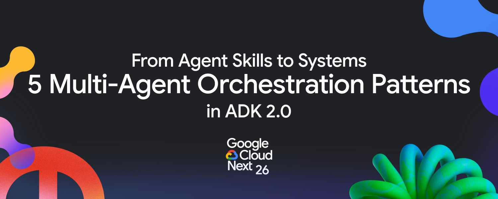

# Google Cloud Tech X Post: From Skills to Systems: 5 Multi-Agent Orchestration Patterns in ADK 2.0

**URL:** https://x.com/i/status/2047367046070161674

**Author:** @GoogleCloudTech (Google Cloud Tech Verified account)

**Date:** 2026-04-23 (inferred)

**Engagement:** 2 replies, 40 reposts, 264 likes, 458 bookmarks, 27K views

## Post Content

From Skills to Systems: 5 Multi-Agent Orchestration Patterns in ADK 2.0

A few weeks ago, our article on [5 Agent Skill design patterns](https://x.com/GoogleCloudTech/status/some-previous) went viral. The patterns (Tool Wrapper, Generator, Reviewer, Inversion, Pipeline) gave developers a structural vocabulary for designing agent skills. But a single skill, no matter how well-designed, only solves part of the problem.

The harder question is: how do you orchestrate multiple skills across multiple agents in a production system? How do you ensure that Agent A's output is the right format for Agent B's input? How do you enforce that certain steps always happen in a certain order while still allowing AI flexibility within each step? How do you coordinate agents written in different languages by different teams?

At Google Cloud Next 26, we launched Agent Development Kit (ADK) 2.0 that answers these questions with three core additions: graph-based workflows, collaborative agents, and a formalized Skills framework. Here are five orchestration patterns that will take you to the next level of agent architecture.

By [@addyosmani](https://x.com/addyosmani) and [@Saboo_Shubham_](https://x.com/Saboo_Shubham_)

### Pattern 1: The Hybrid Graph

The most common production failure in agent systems is an orchestration failure. The agent reasons correctly about each individual step but executes them in the wrong order, skips a mandatory step, or takes a path that no human reviewer anticipated.

This happens because most agent architectures encode workflow logic inside system prompts. The LLM follows the instructions faithfully for the first few turns. By turn seven, it starts taking shortcuts. By turn twelve, it's skipping steps entirely. This is a fundamental limitation of using natural language instructions to define procedural workflows. LLMs are optimizers. They're trained to produce helpful outputs efficiently. When the model looks at a five-step workflow, it often decides it can produce a more helpful response by combining steps or reordering them.

ADK 2.0's graph-based workflows solve this structurally. You define agent logic as a directed graph where nodes are actions and edges are transitions with conditional logic. The critical innovation is that you can mix deterministic nodes (hard-coded business rules) with AI-driven nodes (LLM reasoning) in the same graph.

Here's a concrete example: a loan application processing agent. Some steps must be deterministic (regulatory compliance checks, credit score thresholds, documentation requirements). Other steps benefit from AI flexibility (assessing document quality, summarizing financial profiles, generating recommendations).

## Images Downloaded
- pattern1.jpg: Hybrid Graph diagram
- pattern2.jpg - pattern6.jpg: Subsequent patterns (to be analyzed)

**Note:** Full thread/images captured via browser snapshot on 2026-04-23. Post likely part of thread with more patterns detailed in images.